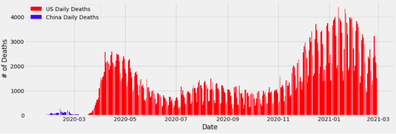

# COVID-19-Data-Visualization
My Jupyter Notebook that displays graphs comparing COVID-19 cases across the United States, China, and worldwide. Libraries include Pandas and MatPlotLib.

Tutorial provided by [Codex](https://thecodex.me)

### Results

### Notes 
The reset_index() for the United States and China dataframes in the cases and deaths cells may need to alternate between comments and code. If left as code for too long, an error message will appear and won't display the graph. That's when those functions needs to be commented out.

### Open-source libraries used

- [Pandas](https://pandas.pydata.org/) - Manipulates and analyzes data
- [Matplotlib](https://matplotlib.org/stable/index.html#) - Implements static visualizations of data in Python
