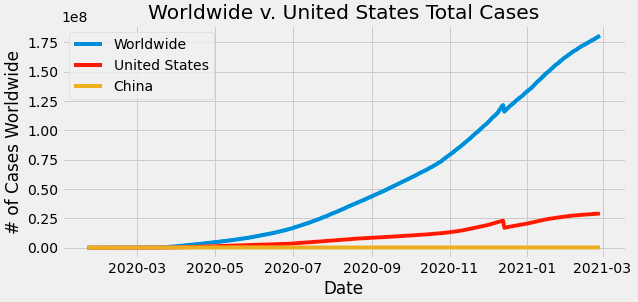

# COVID-19-Data-Visualization
My Jupyter Notebook that analyzes and visualizes current COVID-19 data. Contains 4 complete charts that analyzes worldwide trends and insights from the United States and China. Involves analyzing a sample CSV with Pandas, manipulating columns and applying various Pandas functions, and visualizing results through line charts and stacked bar charts with MatPlotLib.

Tutorial provided by [Codex](https://thecodex.me)

Data provided by [John Hopkins University](https://github.com/datasets/covid-19)

### Results

### Notes 
The reset_index() for the United States and China dataframes in the cases and deaths cells may need to alternate between comments and code. If left as code for too long, an error message will appear and won't display the graph. That's when those functions needs to be commented out.

### Open-source libraries used

- [Pandas](https://pandas.pydata.org/) - Manipulates and analyzes data
- [Matplotlib](https://matplotlib.org/stable/index.html#) - Implements static visualizations of data in Python
